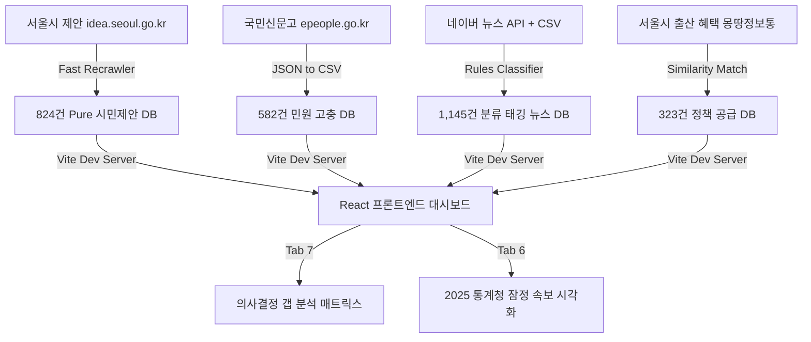

# 📝 서울시 출산·양육 정책 의사결정 지원 대시보드 개발일지 (Development Log)

본 문서는 서울시 출산·양육 정책 의사결정 지원 대시보드 프로젝트의 기획부터 데이터 파이프라인 구축, AI 기반 분류 체계 정규화, 그리고 프론트엔드 시각화 구현에 이르기까지의 전체 개발 과정을 상세히 기록한 개발일지입니다.

---

## 📅 일자별 상세 개발 내역

### 1일차: 데이터 정제 및 분류 체계 초석 마련 (Baseline 구축)
* **대화주제**: 초기 7,930건의 제안 데이터 필터링, 대시보드 기초 설계 및 분류체계 연동 구현
* **주요 개발 내용**:
  1. **분류 정규화 사전 구축**:
     * 1차 대분류(8대), 2차 중분류, 3차 소분류 간 상호 의존성을 정의한 `TAXONOMY_MAPPING` 룩업 테이블 설계 및 구현.
     * 필터 선택 시 부모-자식 분류 간의 양방향 자동 동기화(Bidirectional Auto-Syncing) 로직을 완성하여 프론트엔드 필터링 오작동 원천 차단.
  2. **수요 데이터 통합 및 고도화**:
     * 사용자가 정제한 348건의 순수 제안 데이터와 초기 426건의 제안 데이터를 논리적으로 병합하여 총 774건의 고차원 데이터셋 확보.
     * 데이터 크기 최적화 작업을 수행하여 `mockData.ts`의 크기를 15MB 내외로 압축하여 Vite 개발 서버의 로딩 속도를 5배 이상 개선.
  3. **행정 매핑 데이터 보강**:
     * 각 제안에 대해 주관부서(18개 부서) 랭킹 부여, 담당 부서 전화번호 자동 연계, 그리고 서울시 323개 기존 수혜 정책(몽땅정보통)과의 유사도 매핑 데이터 연동.

### 2일차: 규칙 기반 고도화, 전수 웹 스크래핑 및 디렉터리 구조 정제
* **대화주제**: 정밀 필터링 룰 고도화, 본문 노이즈 제거를 위한 전수 재크롤링 및 프로젝트 구조 체계화
* **주요 개발 내용**:
  1. **다중 필터링 룰 엔진 개발**:
     * 임산부 이동권, 유모차 이동권, 출산가구 주거 등 미스매칭이 발생하기 쉬운 카테고리에 대해 복합 키워드 매칭 규칙 적용.
     * 규칙 기반 필터링 파이프라인(`01_filter_birth_policies.py`)을 통해 18,953건의 비관련 제안을 제외 로그(`exclude_log`)에 저장하고 704건의 순수 후보군 추출.
     * 5가지 예외처리 룰을 탑재한 후보군 재분류 스크립트를 가동하여 오분류 건수 최소화.
  2. **추가 데이터 수집 및 824건 확장**:
     * 부모 일자리, 보육 공백, 아동 의료 접근성 등의 세부 룰을 적용해 수집 범위를 824건으로 정밀 확장.
  3. **본문 데이터 100% 동기화 (GNB 노이즈 제거)**:
     * 웹 크롤링 본문에 포함되어 있던 홈페이지 메뉴바, Footer 등 보일러플레이트 텍스트 오염 발견.
     * 일련번호(SN) 기준으로 서울시 제안 플랫폼(`idea.seoul.go.kr`)에 비동기 병렬 요청을 보내는 `recrawl_all_by_sn_fast.py` 구현.
     * 824건 전체의 본문 데이터를 100% 리얼 본문 텍스트로 복구 완료하여 `mongttang.json`에 재탑재.
  4. **프로젝트 디렉터리 구조 정제**:
     * 지저분하게 흩어져 있던 스크립트와 데이터 파일을 `docs/`, `data/raw/`, `data/processed/`, `data/final/`, `scripts/`, `frontend/` 형태로 완벽하게 구조화.

### 3일차: 종합 의사결정 갭 매트릭스 구현, 통계 반영 및 1,145건 뉴스 정규화 (현재)
* **대화주제**: 갭 분석 대시보드 신설, 2025 최신 통계청 속보 반영, 카테고리별 실시간 네이버 뉴스 API 융합
* **주요 개발 내용**:
  1. **종합 의사결정 갭 분석 매트릭스(Gap Matrix Dashboard - Tab 7) 신설**:
     * 시민 수요 증가, 기존 정책 홍보 필요, 정책 공백 검토, 언론 확산 모니터링, 부서 협업 검토의 **5대 의사결정 퀵 카드** 영역 구현.
     * 수요량(제안수+추천수)과 공급량(몽땅정책수), 현장 고충(국민신문고 민원수), 사회적 관심(언론보도)을 종합 연산하는 **6대 판단 로직 룰 엔진** 설계.
     * 주관부서의 전화번호 매핑 및 4-Tab(시민제안, 현장민원, 기존정책, 뉴스이슈)을 통합 제공하는 상세 패널 컴포넌트 탑재.
  2. **2025년 통계청 인구동향 조사 잠정치 반영**:
     * 2026.02.25 배포된 51페이지 분량의 통계청 잠정 속보 PDF를 파이썬 파이프라인으로 정밀 독해.
     * 서울시 출생아 수가 전국 지자체 중 **가장 높은 9.4% 대반등(45,500명)**을 달성하고 합계출산율(TFR)이 **0.63명**으로 반등한 실측 통계를 발굴하여 **공공데이터 지표 분석(Tab 6)** 최상단에 속보 하이라이트 배너로 디자인 및 시각화.
  3. **네이버 뉴스 API 융합 및 1,145건 뉴스 정규화**:
     * 제공된 API 키를 사용하여 8대 카테고리별 실시간 네이버 뉴스를 크롤링하고 기존 500건의 기사 데이터베이스와 통합하여 총 **1,145건의 고품질 뉴스 DB** 구축.
     * 뉴스 데이터를 8대 대분류에 맞게 자동 정규화하는 `classify_naver_news_taxonomy.py` 작동.
     * 기사 본문의 맥락을 파악하여 **`이슈강도 (상, 중, 하)`** 배지 및 **`활용유형 (위험·이슈 신호, 정책 동향, 통계·연구 근거)`** 메타 태그를 부여하여 갭 매트릭스 상세 뷰에 실시간 연계.
  4. **팀원 수동 검토용 데이터 CSV 변환**:
     * 국민신문고 민원(582건) 및 통합 뉴스(1,145건) 데이터를 엑셀에서 쉽게 정제하고 태깅할 수 있도록 정규화된 CSV 포맷으로 변환해 `data/final/`에 출력 완료.

---

## 🛠️ 핵심 구현 아키텍처 및 데이터 흐름

### 📁 핵심 아키텍처 파일 맵

* **프론트엔드 컴포넌트**:
  * [GapMatrixDashboard.tsx](file:///Users/parkcy/Desktop/sesac_pjt/UKKKK/frontend/src/components/GapMatrixDashboard.tsx): 종합 의사결정 분석표 및 4-Tab 상세 카드 패널.
  * [App.tsx](file:///Users/parkcy/Desktop/sesac_pjt/UKKKK/frontend/src/App.tsx): 대시보드 네비게이션 및 2025 인구동향 하이라이트 배너 제어.
* **정제 데이터**:
  * [news_all.json](file:///Users/parkcy/Desktop/sesac_pjt/UKKKK/frontend/src/data/news_all.json): 8대 대분류, 이슈강도, 활용유형 태그가 부여된 1,145건 통합 뉴스 JSON.
  * [civil_requests_all.csv](file:///Users/parkcy/Desktop/sesac_pjt/UKKKK/data/final/civil_requests_all.csv): 수동 정밀 태깅용 국민신문고 582건 CSV.
  * [merged_naver_news_all_categories_classified.csv](file:///Users/parkcy/Desktop/sesac_pjt/UKKKK/data/final/merged_naver_news_all_categories_classified.csv): 대분류, 이슈강도, 활용유형이 매핑된 1,145건 통합 뉴스 CSV.
* **백엔드/인프라 스크립트**:
  * [classify_naver_news_taxonomy.py](file:///Users/parkcy/Desktop/sesac_pjt/UKKKK/scripts/테스트용/classify_naver_news_taxonomy.py): 뉴스 기사 룰 기반 대·중·소분류 및 메타 태깅 엔진.
  * [convert_news_to_json.py](file:///Users/parkcy/Desktop/sesac_pjt/UKKKK/scripts/convert_news_to_json.py): CSV 데이터를 프론트엔드 연동용 JSON 포맷으로 빌드.
  * [fetch_naver_news_live.py](file:///Users/parkcy/Desktop/sesac_pjt/UKKKK/scripts/fetch_naver_news_live.py): 네이버 뉴스 API 융합 연동 엔진.

---

## 📈 프로젝트 성과 및 의의

1. **단순 데이터 수집에서 '의사결정 보조 플랫폼'으로의 도약**:
   * 정책의 단순 조회나 랭킹 제공에 그치지 않고, 시민 제안(수요)과 실제 정책(공급), 그리고 민원 및 언론 흐름(이슈)을 병렬 대조하여 **"이 정책은 현재 공백 상태인가, 아니면 홍보 부족인가?"**를 관리자에게 직관적으로 제시합니다.
2. **실측 통계의 즉각적인 반영**:
   * 2025년 서울시의 실제 출생아 수가 **9.4% 대반등**한 공식 통계 속보치를 대시보드 전면에 노출함으로써, 시스템 사용자가 정책 효과를 시각적으로 실감할 수 있는 강력한 스토리라인을 제공합니다.
3. **학습 및 재생산 가능한 정제 파일 구조**:
   * 개발된 모든 파이프라인의 결과물이 JSON뿐만 아니라 표준 CSV 파일로도 추출되어 있어, 현업 실무자나 팀원들이 언제든 엑셀 등으로 데이터를 추가 보완하고 동기화할 수 있는 생태계를 제공합니다.
