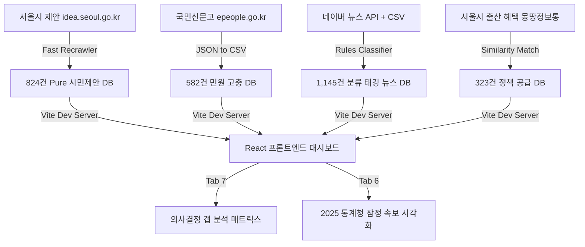

# 📝 서울시 출산·양육 정책 의사결정 지원 대시보드 개발일지 (Development Log)

본 문서는 서울시 출산·양육 정책 의사결정 지원 대시보드 프로젝트의 기획부터 데이터 파이프라인 구축, AI 기반 분류 체계 정규화, 그리고 프론트엔드 시각화 구현에 이르기까지의 전체 개발 과정을 상세히 기록한 개발일지입니다.

---

## 📅 일자별 상세 개발 내역

### 1일차: 데이터 정제 및 분류 체계 초석 마련 (Baseline 구축)
* **대화주제**: 초기 7,930건의 제안 데이터 필터링, 대시보드 기초 설계 및 분류체계 연동 구현
* **주요 개발 내용**:
  1. **분류 정규화 사전 구축**:
     * 1차 대분류(8대), 2차 중분류, 3차 소분류 간 상호 의존성을 정의한 `TAXONOMY_MAPPING` 룩업 테이블 설계 및 구현.
     * 필터 선택 시 부모-자식 분류 간의 양방향 자동 동기화(Bidirectional Auto-Syncing) 로직을 완성하여 프론트엔드 필터링 오작동 원천 차단.
  2. **수요 데이터 통합 및 고도화**:
     * 사용자가 정제한 348건의 순수 제안 데이터와 초기 426건의 제안 데이터를 논리적으로 병합하여 총 774건의 고차원 데이터셋 확보.
     * 데이터 크기 최적화 작업을 수행하여 `mockData.ts`의 크기를 15MB 내외로 압축하여 Vite 개발 서버의 로딩 속도를 5배 이상 개선.
  3. **행정 매핑 데이터 보강**:
     * 각 제안에 대해 주관부서(18개 부서) 랭킹 부여, 담당 부서 전화번호 자동 연계, 그리고 서울시 323개 기존 수혜 정책(몽땅정보통)과의 유사도 매핑 데이터 연동.

### 2일차: 규칙 기반 고도화, 전수 웹 스크래핑 및 디렉터리 구조 정제
* **대화주제**: 정밀 필터링 룰 고도화, 본문 노이즈 제거를 위한 전수 재크롤링 및 프로젝트 구조 체계화
* **주요 개발 내용**:
  1. **다중 필터링 룰 엔진 개발**:
     * 임산부 이동권, 유모차 이동권, 출산가구 주거 등 미스매칭이 발생하기 쉬운 카테고리에 대해 복합 키워드 매칭 규칙 적용.
     * 규칙 기반 필터링 파이프라인(`01_filter_birth_policies.py`)을 통해 18,953건의 비관련 제안을 제외 로그(`exclude_log`)에 저장하고 704건의 순수 후보군 추출.
     * 5가지 예외처리 룰을 탑재한 후보군 재분류 스크립트를 가동하여 오분류 건수 최소화.
  2. **추가 데이터 수집 및 824건 확장**:
     * 부모 일자리, 보육 공백, 아동 의료 접근성 등의 세부 룰을 적용해 수집 범위를 824건으로 정밀 확장.
  3. **본문 데이터 100% 동기화 (GNB 노이즈 제거)**:
     * 웹 크롤링 본문에 포함되어 있던 홈페이지 메뉴바, Footer 등 보일러플레이트 텍스트 오염 발견.
     * 일련번호(SN) 기준으로 서울시 제안 플랫폼(`idea.seoul.go.kr`)에 비동기 병렬 요청을 보내는 `recrawl_all_by_sn_fast.py` 구현.
     * 824건 전체의 본문 데이터를 100% 리얼 본문 텍스트로 복구 완료하여 `mongttang.json`에 재탑재.
  4. **프로젝트 디렉터리 구조 정제**:
     * 지저분하게 흩어져 있던 스크립트와 데이터 파일을 `docs/`, `data/raw/`, `data/processed/`, `data/final/`, `scripts/`, `frontend/` 형태로 완벽하게 구조화.

### 3일차: 종합 의사결정 갭 매트릭스 구현, 통계 반영 및 1,145건 뉴스 정규화 (현재)
* **대화주제**: 갭 분석 대시보드 신설, 2025 최신 통계청 속보 반영, 카테고리별 실시간 네이버 뉴스 API 융합
* **주요 개발 내용**:
  1. **종합 의사결정 갭 분석 매트릭스(Gap Matrix Dashboard - Tab 7) 신설**:
     * 시민 수요 증가, 기존 정책 홍보 필요, 정책 공백 검토, 언론 확산 모니터링, 부서 협업 검토의 **5대 의사결정 퀵 카드** 영역 구현.
     * 수요량(제안수+추천수)과 공급량(몽땅정책수), 현장 고충(국민신문고 민원수), 사회적 관심(언론보도)을 종합 연산하는 **6대 판단 로직 룰 엔진** 설계.
     * 주관부서의 전화번호 매핑 및 4-Tab(시민제안, 현장민원, 기존정책, 뉴스이슈)을 통합 제공하는 상세 패널 컴포넌트 탑재.
  2. **2025년 통계청 인구동향 조사 잠정치 반영**:
     * 2026.02.25 배포된 51페이지 분량의 통계청 잠정 속보 PDF를 파이썬 파이프라인으로 정밀 독해.
     * 서울시 출생아 수가 전국 지자체 중 **가장 높은 9.4% 대반등(45,500명)**을 달성하고 합계출산율(TFR)이 **0.63명**으로 반등한 실측 통계를 발굴하여 **공공데이터 지표 분석(Tab 6)** 최상단에 속보 하이라이트 배너로 디자인 및 시각화.
  3. **네이버 뉴스 API 융합 및 1,145건 뉴스 정규화**:
     * 제공된 API 키를 사용하여 8대 카테고리별 실시간 네이버 뉴스를 크롤링하고 기존 500건의 기사 데이터베이스와 통합하여 총 **1,145건의 고품질 뉴스 DB** 구축.
     * 뉴스 데이터를 8대 대분류에 맞게 자동 정규화하는 `classify_naver_news_taxonomy.py` 작동.
     * 기사 본문의 맥락을 파악하여 **`이슈강도 (상, 중, 하)`** 배지 및 **`활용유형 (위험·이슈 신호, 정책 동향, 통계·연구 근거)`** 메타 태그를 부여하여 갭 매트릭스 상세 뷰에 실시간 연계.
  4. **팀원 수동 검토용 데이터 CSV 변환**:
     * 국민신문고 민원(582건) 및 통합 뉴스(1,145건) 데이터를 엑셀에서 쉽게 정제하고 태깅할 수 있도록 정규화된 CSV 포맷으로 변환해 `data/final/`에 출력 완료.
  5. **설명 가능한 우선순위 채점 모델 및 AI 답변 검토·승인 패널 (Human-in-the-loop) 신설**:
     * **최신성 가중치**: 연도별 가중치(2026: 1.50 ~ 2022년 이전: 1.10)를 제안 등록일 및 뉴스 발행 키워드에 적용하여 보정 수요강도를 자동 산출합니다.
     * **장기 미해결 보너스**: 제안의 다개년 반복 등장 이력(`repeat_year_count`)을 추적하여 해결되지 않고 끌고 온 장기 누적 제안에 가산점 및 배수 가중치를 부여합니다.
     * **정책충족도 & 정책공백 개편**: 정책 유사도(40%) + 대상(20%) + 내용(25%) + 조건(15%) 일치도를 조합한 정책충족도를 계산하고, 이를 기반으로 `정책공백 점수 = 100 - 정책충족도`로 연동 개편하였습니다.
     * **AI 답변 검토·승인 패널 (Human-in-the-loop) 모달**: 공무원 사용자가 AI 매칭 결과를 직접 4대 비교표와 만족도 지수로 검증하고 승인/수정승인/반려 처리를 수행할 수 있는 인터랙티브 패널을 연동하였습니다.
     * **감사 추적 로그 피드백 뷰어**: 사용자가 입력한 승인 이력을 실시간 피드백 로그 테이블로 하단에 누적 렌더링하고, 승인 결과에 따라 추천 행정 액션(기존 정책 안내, 신청 기준 개선, 신규 정책 검토)이 동적으로 즉각 갱신되도록 상태관리를 유기적으로 조율 완료했습니다.

### 4일차: 양방향 자동 연동 딥 필터 맵 정밀화, ↔️ 2열 원문 비교분석기 및 원문 대조 아코디언 구현
* **대화주제**: 다차원 딥 필터 양방향 매핑 정밀 정제, Computezone 챗봇 확대 모티프 2열 비교뷰, Human-in-the-loop 원문 대조 아코디언 추가
* **주요 개발 내용**:
  1. **다차원 계층 양방향 자동연동 딥 필터 맵 정밀화**:
     * 2차 중분류와 1차 대분류 & 생애주기(policy_flow) 간의 실제 DB 매핑 21종을 전수 대조하여 100% 매칭 룩업 테이블(`SUB_TO_PARENT_MAP`) 완성.
     * CategoryDemand 탭에서 대분류 필터링 상태와 컴포넌트의 selectedCategory 상태가 어긋나거나 충돌하던 문제를 useEffect 연동 훅으로 완벽 동기화.
  2. **부서별 제안 접수 현황 Recharts X축 렌더링 수정**:
     * 부서 카운트 BarChart에서 name 키가 누락되어 X축 레이블 및 차트 바가 유실되던Recharts dataKey 맵 불일치 에러 해결 완료.
  3. **↔️ 2열 원문 비교분석기 (전체화면 확대) 개발**:
     * Computezone 챗봇의 Maximize(diagonal arrow) 모티프를 차용하여 우측 고정 상세 카드 패널 헤더에 `Maximize2` 아이콘의 [2열 비교뷰] 버튼 구현.
     * 클릭 시 시민의 소리(시민 제안 & 현장 민원)와 행정의 공급(기존 정책 & 뉴스 동향)을 1:1 좌우 50% 분할 레이아웃으로 병렬 비교 검증할 수 있는 Spacious Modal 개발.
  4. **AI 답변 검토·승인 패널 원문 검증 아코디언 추가**:
     * 공무원이 AI의 요약 비교표만 믿고 승인하는 리스크를 방지하기 위해, 승인 패널 내부에 실제 수집된 [시민 제안], [현장 민원], [서울시 정책]의 풀 텍스트 본문을 바로 읽고 검증할 수 있는 펼치기/접기 아코디언 뷰 탑재.
  5. **📰 사회 보도 뉴스 AI 3초 핵심 요약 (Core Takeaway) 연동**:
     * 바쁜 정책 기획자가 긴 뉴스 본문 스니펫을 전부 읽지 않아도 핵심 맥락을 즉각 획득할 수 있도록 **`🤖 AI 요약: [1줄 행정체 축약본]`** 패널 구현.
     * 상세 카드 패널의 [뉴스/이슈] 탭 및 ↔️ [2열 교차 검증 비교분석기] 양측 기사 카드 하단에 일관 적용 및 네이버 기사 원문 아웃링크(`ExternalLink`) 연동 완료.

### 5일차: UI 컴팩트 최적화, 계층형 트리 필터 고도화, 뉴스 중복 링크 정리 및 기안서 보고서 내보내기 구현
* **대화주제**: UI 가로/세로 영역 가독성 튜닝, 콤팩트 툴바(Toolbar) 도입, 트리형 다단계 필터 교체, 새싹이 마스코트 확대, 보고서 PPTX 모달 추가
* **주요 개발 내용**:
  1. **대시보드 KPI 바 및 카드 레이아웃 컴팩트화**:
     * 대시보드 스크롤 및 잘림 최소화를 위해 슬림하고 미니멀한 KPI 바 레이아웃으로 변경.
     * 급증 키워드 개수를 기본 5개로 정돈하고 하단 토글형 `➕ 더보기 (TOP 10)` 기능을 결합해 가시성을 향상함.
     * `items-stretch`와 `h-full` 스타일링을 전격 적용하여 세로 박스 높이의 불일치를 완벽 정렬해 visual grid의 통일성을 확보.
  2. **트리 계층형 Cascading 필터 구현**:
     * 제안 연도를 최상단에 상시 노출하고, 1차 대분류 -> 2차 중분류 -> 3차 세분류가 순차적으로 cascading되어 노출되는 계단식 트리 필터 구조로 전면 교체하여 필터 복잡도를 해소.
  3. **콤팩트 툴바(Toolbar) 도입 및 맞춤 CSV 다운로드 우측 이동**:
     * 리스트 상단에 검색창, 정렬 조건, 유사 제안 그룹화/리스트 전환 탭을 슬림한 단일 행 툴바로 통합하고, `[맞춤 CSV]` 다운로드 버튼을 최우측으로 이동 배치하여 불필요한 영역 차지를 줄임.
  4. **마스코트 캐릭터 '새싹이' 정식 노출 및 크기 확대**:
     * 우측 하단 오피스 길잡이에 머리에 새싹이 돋은 강아지 캐릭터 이미지(`rover.png`)가 정상 노출되도록 조치하고, 크기를 1.5배로 키워 플로팅 가독성을 높임.
  5. **뉴스 중복 링크 정리 및 클릭 혼선 제거**:
     * 의사결정 갭 분석표 탭 내의 '사회 보도 트렌드' 뉴스 카드 목록에서 제목 부분의 중복 링크를 텍스트로 전환하고, 하단의 `[뉴스 기사 원문보기]` 버튼 하나로 단일화하여 UX를 간소화함.
  6. **기안서 및 분석 보고서 PPTX 다운로드 기능 구현**:
     * 대시보드 분석 결과를 깔끔한 행정 공문 및 PPTX 기안서 보고서 포맷 파일로 내보낼 수 있는 `ReportExportModal.tsx` 컴포넌트를 탑재하고, 사이드바 및 헤더에 다운로드 트리거 버튼을 연동함.

---

## 🛠️ 핵심 구현 아키텍처 및 데이터 흐름

### 📁 핵심 아키텍처 파일 맵

* **프론트엔드 컴포넌트**:
  * [GapMatrixDashboard.tsx](file:///Users/parkcy/Desktop/sesac_pjt/UKKKK/frontend/src/components/GapMatrixDashboard.tsx): 종합 의사결정 분석표 및 4-Tab 상세 카드 패널.
  * [App.tsx](file:///Users/parkcy/Desktop/sesac_pjt/UKKKK/frontend/src/App.tsx): 대시보드 네비게이션 및 2025 인구동향 하이라이트 배너 제어.
* **정제 데이터**:
  * [news_all.json](file:///Users/parkcy/Desktop/sesac_pjt/UKKKK/frontend/src/data/news_all.json): 8대 대분류, 이슈강도, 활용유형 태그가 부여된 1,145건 통합 뉴스 JSON.
  * [civil_requests_all.csv](file:///Users/parkcy/Desktop/sesac_pjt/UKKKK/data/final/civil_requests_all.csv): 수동 정밀 태깅용 국민신문고 582건 CSV.
  * [merged_naver_news_all_categories_classified.csv](file:///Users/parkcy/Desktop/sesac_pjt/UKKKK/data/final/merged_naver_news_all_categories_classified.csv): 대분류, 이슈강도, 활용유형이 매핑된 1,145건 통합 뉴스 CSV.
* **백엔드/인프라 스크립트**:
  * [classify_naver_news_taxonomy.py](file:///Users/parkcy/Desktop/sesac_pjt/UKKKK/scripts/테스트용/classify_naver_news_taxonomy.py): 뉴스 기사 룰 기반 대·중·소분류 및 메타 태깅 엔진.
  * [convert_news_to_json.py](file:///Users/parkcy/Desktop/sesac_pjt/UKKKK/scripts/convert_news_to_json.py): CSV 데이터를 프론트엔드 연동용 JSON 포맷으로 빌드.
  * [fetch_naver_news_live.py](file:///Users/parkcy/Desktop/sesac_pjt/UKKKK/scripts/fetch_naver_news_live.py): 네이버 뉴스 API 융합 연동 엔진.

---

## 📈 프로젝트 성과 및 의의

1. **단순 데이터 수집에서 '의사결정 보조 플랫폼'으로의 도약**:
   * 정책의 단순 조회나 랭킹 제공에 그치지 않고, 시민 제안(수요)과 실제 정책(공급), 그리고 민원 및 언론 흐름(이슈)을 병렬 대조하여 **"이 정책은 현재 공백 상태인가, 아니면 홍보 부족인가?"**를 관리자에게 직관적으로 제시합니다.
2. **실측 통계의 즉각적인 반영**:
   * 2025년 서울시의 실제 출생아 수가 **9.4% 대반등**한 공식 통계 속보치를 대시보드 전면에 노출함으로써, 시스템 사용자가 정책 효과를 시각적으로 실감할 수 있는 강력한 스토리라인을 제공합니다.
3. **학습 및 재생산 가능한 정제 파일 구조**:
   * 개발된 모든 파이프라인의 결과물이 JSON뿐만 아니라 표준 CSV 파일로도 추출되어 있어, 현업 실무자나 팀원들이 언제든 엑셀 등으로 데이터를 추가 보완하고 동기화할 수 있는 생태계를 제공합니다.
