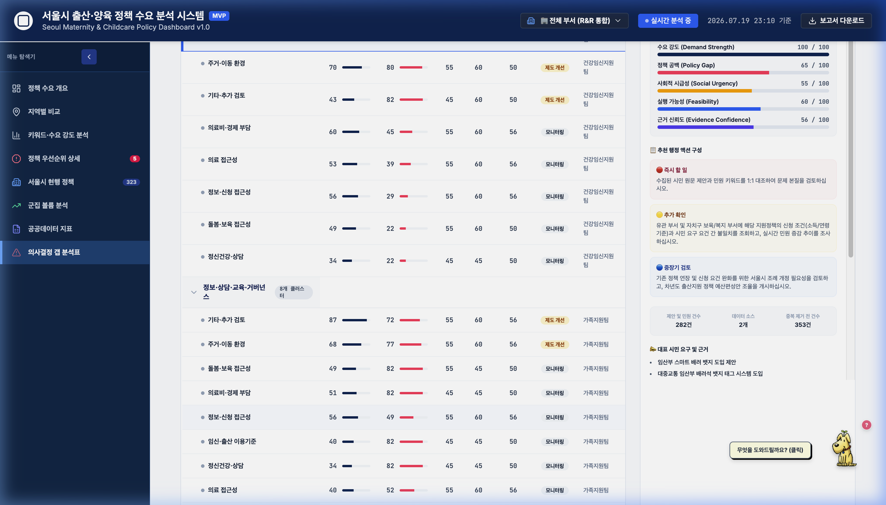
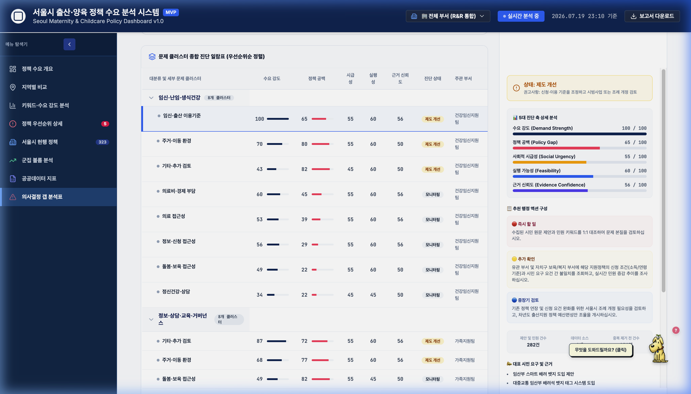
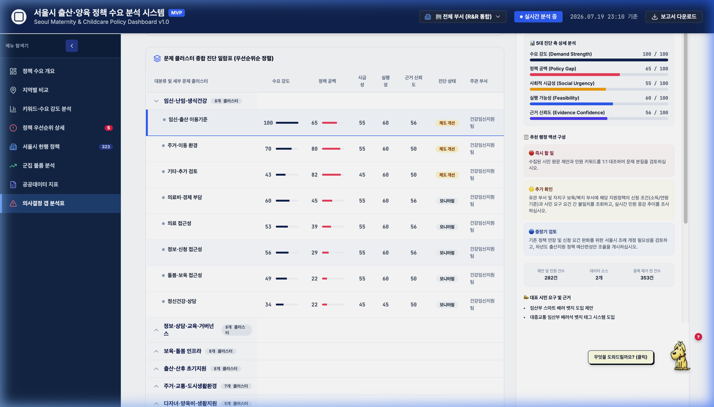
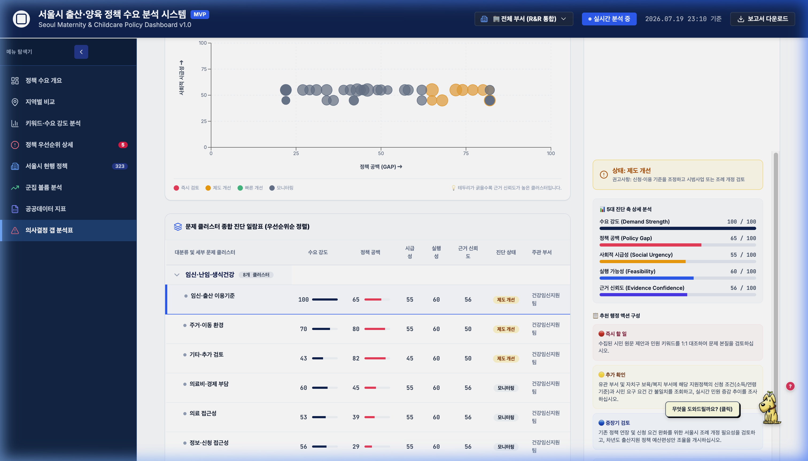
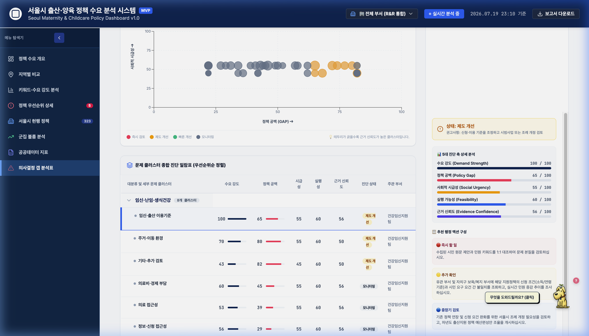
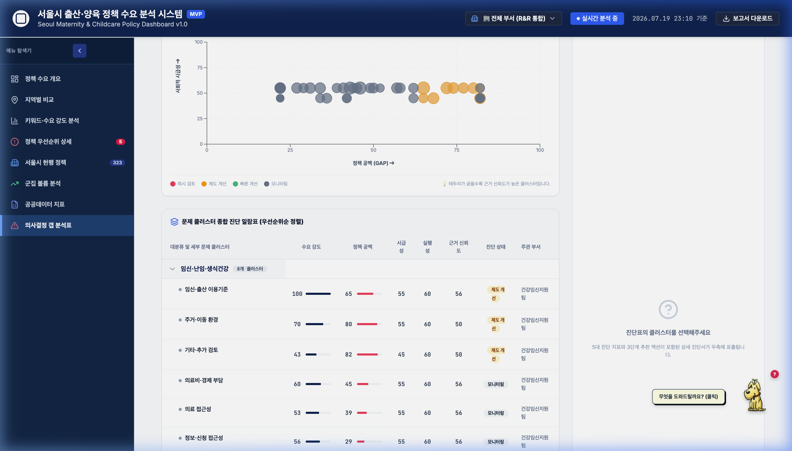

# 🎙️ 데모데이 피치덱 발표 구성안 및 스크립트 (UKKKK 최종본)

본 문서는 **서울시 출산·보육 정책 수요 분석 대시보드 (UKKKK)** 프로젝트의 최종 데모데이 발표를 위해 제작된 발표용 구성안 및 상세 대본입니다. 
정보 과부하를 막고 청중의 주의를 집중시키기 위해 **[PPT 슬라이드 내 텍스트 최소화 (Minimal Text, Visual-First)]** 정책을 일관되게 적용했습니다. 슬라이드 자체에는 **'핵심 타이틀 1개', '대표 이미지/그래프/빅넘버 1개', 그리고 '새싹이(Rover) 🐶 말풍선 1개'**만 간결하게 배치하며, 상세한 행정적 의미와 기술적 스펙은 발표자의 생생한 목소리(Script)로 전달하는 고성능 피칭 디자인을 따릅니다.

특히 **대시보드 기능 및 인터랙티브 흐름 설명(Part 3)**에서는 청중이 화면 전개를 쫓아오기 쉽도록 사용자의 실제 클릭 액션 단위로 슬라이드를 세부 단계별(**Slide 3-1, 3-1-1 등**)로 정밀 분할하였으며, **실제 대시보드 스크린샷 이미지 삽입 경로**를 물리적으로 명시해 두었습니다.

---

## 📅 피치덱 슬라이드 전체 빌드업 요약표 (10분 발표)

| 파트 구분 | 슬라이드 번호 | 주제 | 장표 시각 요소 (글씨 최소화, 이미지 경로 매핑) | 발표 시간 |
| :--- | :---: | :--- | :--- | :---: |
| **오프닝** | **Slide 0** | 표지 및 팀 R&R 소개 | 타이틀 및 4인 역할명, 웰컴 새싹이 🐶 | `15초` |
| **[Part 1] 비즈니스 분석 결과** | **Slide 1-1** **Slide 1-2** **Slide 1-3** **Slide 1-4** | 비즈니스 문제 제기 행정 현황 AS-IS ➔ TO-BE 선행 연구 대조 ① (보육 수요) 선행 연구 대조 ② (출산 장벽) | - 민원 폭풍 속에 파묻힌 김민우 주무관 일러스트 - 파편화된 R&R 분산 vs 통합 아키텍처 다이어그램 - 빅넘버 **992건** & 3대 수요 키워드 태그 - 빅넘버 **25,800건** & 3대 장벽 키워드 태그 | `20초` `25초` `35초` `35초` |
| **[Part 2] 데이터 & 모델링 설명** | **Slide 2-1** **Slide 2-2** **Slide 2-3** | 5원 Multi-API 데이터 파이프라인 전처리 및 AI·규칙 라우팅 모델 우선순위 및 정책 공백도 공식 | - 5개 입력 노드가 수집 깔때기로 모이는 인포그래픽 - SBERT, Gemini, R&R 규칙 엔진 분류 흐름도 - 우선순위 산출 공식 $Score = f(D, U, G, N)$ 수식 | `40초` `45초` `45초` |
| **[Part 3] 대시보드 설계** | **Slide 3-1** **Slide 3-1-1** **Slide 3-2** **Slide 3-2-1** **Slide 3-3** **Slide 3-3-1** **Slide 3-4** **Slide 3-5** | 화면 ① 종합현황 지도 (기본) 화면 ①-1 종합현황 지도 (클릭) 화면 ② 8대 수요 필터 (Pruning) 화면 ②-1 일괄 답변 기안 모달 화면 ③ 갭 매트릭스 (버블차트) 화면 ③-1 결재 패널 및 로그 이력 화면 ④ 새싹이 오피스 길잡이 전체 사용자 태스크플로우 | - `slide_3-1_map_default.png` (종합 지도 기본) - `slide_3-1-1_map_clicked.png` (양천구 클릭 연동) - `slide_3-2-1_filter_strike.png` (필터 취소선 UX) - `slide_3-2-2_export_modal.png` (공문 생성 모달) - `slide_3-3-1_gap_matrix.png` (갭 버블차트) - `slide_3-3-2_action_feedback.png` (결재 패널 및 로그) - 윈도우 95 스타일 새싹이 오피스 도움말 패널 스펙 카드 - 트리 구조로 설계된 전체 태스크플로우 다이어그램 | `20초` `25초` `20초` `25초` `20초` `25초` `30초` `30초` |
| **[Part 4] 라이브 데모** | **Slide 4-1** | 실시간 라이브 데모 스피드런 | 브라우저 모형 프레임 및 시연 링크 버튼 | `60초` |
| **[Part 5] 검증 및 성장 계획** | **Slide 5-1** **Slide 5-2** **Slide 5-3** | 도입 효과성 검증 시나리오 기술 고도화 로드맵 엔딩 및 질의응답 (Q&A) | - 업무 시간 단축 비교 바 차트 (**15분 vs 15초**) - 컨테이너 포트 최적화 및 GraphRAG 타임라인 화살표 - 대형 타이틀 **"Q & A"**, 거수경례 새싹이 🐶 | `35초` `35초` `Q&A` |
| **APPENDIX** | **Slide A-1** | 최종 산출물 및 경로 매핑 | 6대 산출물 1클릭 하이퍼링크 리스트 테이블 | `Q&A` |

---

## 📂 슬라이드별 구성 가이드 및 상세 스크립트 (Script)

### Slide 0: 표지 및 오프닝
* **PPT 화면 구성**: 
  - 세련된 다크 블루 톤 배경.
  - 대형 프로젝트 타이틀 **"UKKKK"**, 서브 타이틀 **"서울시 출산·보육 정책 대시보드"**.
  - **이름의 이중적 의미 시각화**:
    - *기술적 의미*: **Unified Key-Knowledge Kit** (공무원의 신속한 의사결정을 돕는 '통합 핵심지식 키트')
    - *브랜드 의미*: **U**자형 아기 요람(또는 엄마의 포용하는 품) 안에 **K**(Kid/아이)들이 점점 많아지며 번성하는 모습(K ➔ KK ➔ KKK ➔ KKKK)을 형상화.
  - 팀원 4인의 이름 및 파트 역할 텍스트.
  - 우측 하단에 손을 흔드는 **새싹이(Rover) 🐶**와 말풍선.
  - *새싹이 말풍선*: "안녕하세요! 서울시 저출생 행정 혁신을 돕는 오피스 길잡이 새싹이입니다🌱"
* **시간**: `15초`

> **[스크립트]**
> 안녕하세요. 서울시 출산·보육 정책 수요 분석 대시보드 **"UKKKK"**의 발표를 맡은 [발표자 이름]입니다.
> 
> 저희 프로젝트 명칭인 **UKKKK**는 실무적 관점에서는 공무원의 신속한 의사결정을 돕는 **'Unified Key-Knowledge Kit (통합 핵심지식 키트)'**를 뜻합니다.
> 동시에 디자인적으로는 따뜻한 브랜드 스토리를 담고 있습니다. **U**는 아기가 누워 있는 요람이자 엄마가 포용하는 품을 상징하고, 그 품 안에서 **K(Kid)**, 즉 아이들이 점점 불어나며 대한민국이 저출생 소멸 위기를 극복하고 함께 번영해 나가는 따뜻한 성장의 소망을 형상화했습니다.
> 
> 오늘 발표는 대시보드 내부에서 공무원을 안내하는 마스코트이자 저희의 든든한 안내견인 **'새싹이(Rover)'**와 함께 저출생 극복을 위한 정책 공백을 찾으러 가보겠습니다.

---

### 📌 [Part 1] 비즈니스 분석 결과: 어떤 문제를 왜 데이터로 풀고자 했는가

* **PART 1 간지 장표**: "PART 1. 비즈니스 분석 결과" (화면 중앙에 대형 텍스트로만 심플하게 배치)

#### Slide 1-1: 비즈니스 문제 제기 (실무 공무원의 Pain Point)
* **PPT 화면 구성**:
  - 헤드라인 타이틀: **"매일 쏟아지는 시민의 목소리, 행정의 현실은?"**
  - 사방에서 날아오는 제안 및 민원 서류 뭉치와 텍스트 폭풍 속에 파묻혀 쩔쩔매며 울고 있는 서울시 여성가족실 3년 차 **'김민우 주무관'** 및 새싹이 🐶 일러스트.
  - *새싹이 말풍선*: "민원과 제안이 매일 쏟아지는데... 담당 부서는 어디고, 공백은 어떻게 찾죠? 멍멍! 😭"
* **시간**: `20초`

> **[스크립트]**
> 저출생 극복은 서울시의 가장 시급한 과제이지만, 실제 현장 실무자가 마주하는 행정 업무는 매우 가혹합니다. 매일 상상대로 서울과 국민신문고 등 여러 채널에서 시민 제안과 고충 민원이 쏟아지지만, 화면의 실무자인 저출생담당관 김민우 주무관과 새싹이 일러스트처럼 실무자는 어떤 민원이 우선순위인지, 어디서 정책 공백이 발생하는지 수작업으로 찾느라 쩔쩔매며 소중한 행정 시간을 소모하고 있습니다.

---

#### Slide 1-2: 현황 진단 및 해결 방향 (AS-IS ➔ TO-BE)
* **PPT 화면 구성**:
  - 헤드라인 타이틀: **"파편화에서 실시간 융합으로"**
  - **좌측 (AS-IS)**: 상상대로, 국민신문고, 몽땅정보통 로고가 연결 고리 없이 18개 부서로 파편화되어 흩어져 있는 인포그래픽.
  - **우측 (TO-BE)**: 5원 데이터가 하나의 통합 파이프라인으로 연결되고 AI 라우팅 및 갭 진단 대시보드로 통합되어 R&R이 해결되는 흐름도.
  - *새싹이 말풍선*: "김민우 주무관님의 파편화된 채널을 묶어서 AI 라우팅과 갭 진단으로 한눈에 파악할게요! 💡"
* **시간**: `25초`

> **[스크립트]**
> 이 병목의 근본적인 원인은 행정 체계와 채널의 파편화입니다. 기존의 AS-IS 구조에서는 시민 수요와 공급 정책이 단절되어 있었고, 담당 부서도 각자 흩어져 수작업으로 대조할 수밖에 없었습니다. 저희는 이 파편화된 고리를 연결하여 5원 데이터 융합을 통해 부서 R&R을 자동 라우팅하고 정책 공백을 1클릭으로 포착하여 해결하는 TO-BE 아키텍처를 설계했습니다.

---

#### Slide 1-3: 선행 연구 대조 ① (시민의 실질적 보육 수요)
* **PPT 화면 구성**:
  - 헤드라인 타이틀: **"시민이 요구하는 보육의 핵심은?"**
  - 좌측에 빅넘버 **`992건`** (국민신문고 저출산 민원 수).
  - 우측에 핵심 키워드 태그 3개: `시간제 보육 예약 편의` / `소아 응급 의료` / `맞벌이 돌봄 공백 해소`.
  - 하단에 돋보기를 든 새싹이 🐶 및 출처 자막 (*한국생활과학회지 35(1), 홍향희·이정화*).
  - *새싹이 말풍선*: "일회성 축하금보다 지속 가능한 돌봄 인프라에 시민들이 목말라 있어요! 🔎"
* **시간**: `35초`

> **[스크립트]**
> 저희는 공무원들이 납득할 수 있는 두 편의 선행 연구 통계를 기획의 뼈대로 삼았습니다.
> 첫째, 홍향희 교수팀의 2026년 연구입니다. 국민신문고 저출산 민원 992건을 CONCOR 분석한 결과, 시민들은 단순히 낳을 때 한 번 주는 축하금보다 시간제 보육 예약 대기 개선, 소아 응급 의료, 맞벌이 돌봄 해소 등 실질적이고 연속적인 보육 인프라에 대한 수요 강도가 월등히 높음을 입증했습니다.

---

#### Slide 1-4: 선행 연구 대조 ② (결혼과 출산의 현실적 장벽)
* **PPT 화면 구성**:
  - 헤드라인 타이틀: **"결혼과 출산을 가로막는 진짜 장벽"**
  - 좌측에 빅넘버 **`25,800건`** (저출산 뉴스 댓글 수).
  - 우측에 핵심 키워드 태그 3개: **`주택·주거`** / **`일자리`** / **`비용`** (동시 출현 1순위 단어).
  - 하단에 자를 든 새싹이 🐶 및 출처 자막 (*디지털융복합연구 19(12), 이정기*).
  - *새싹이 말풍선*: "결혼과 출산을 망설이게 하는 주거비와 일·가정 양립의 공백이 입증되었습니다! 🔎"
* **시간**: `35초`

> **[스크립트]**
> 둘째, 이정기 교수의 2021년 연구는 뉴스 댓글 25,800건의 빅데이터를 텍스트 마이닝했습니다. 
> 분석 결과, 청년들이 '결혼' 및 '출산'이라는 단어와 동시에 가장 높은 빈도로 언급한 키워드가 바로 '주택', '주거', '일자리', '비용'이었습니다. 즉, 청년층이 결혼과 출산을 결심하기 위한 근본적인 선결 과제가 출산가구의 주거 안정과 일·가정 양립의 고용 환경임을 실증한 것입니다. 
> 저희는 이 두 학술적 통계를 바탕으로 8대 분석 체계를 설계했습니다.

---

### 📌 [Part 2] 데이터 & Modeling 설명: 데이터 파이프라인과 고도화 방법론

* **PART 2 간지 장표**: "PART 2. 데이터 & 모델링 설명" (화면 중앙에 대형 텍스트로만 심플하게 배치)

#### Slide 2-1: 5원 Multi-API 데이터 파이프라인
* **PPT 화면 구성**:
  - 헤드라인 타이틀: **"5가지 데이터의 실시간 수집 구조"**
  - 5개 입력 단 노드(상상대로 제안, 신문고 민원, 몽땅 정책, 뉴스 기사, 공공 통계)가 깔때기를 통해 통합 파일럿으로 모이는 인포그래픽 흐름도.
  - 깔때기 옆에 데이터를 수집하는 새싹이 🐶 배치.
  - *새싹이 말풍선*: "제안, 민원, 정책, 뉴스, 출생아 통계가 실시간으로 수집됩니다! 📥"
* **시간**: `40초`

> **[스크립트]**
> 저희는 시민의 목소리와 행정 데이터를 유기적으로 연결하기 위해 5원 융합 파이프라인을 가동했습니다. 
> 중복 및 노이즈가 제거된 상상대로 서울 제안 824건과 국민신문고 실시간 민원 582건, 몽땅정보통 정책 DB 323개, 그리고 네이버 실시간 기사 1,145건을 융합했습니다. 
> 여기에 통계청의 2025년 최종 잠정 속보치인 서울시 합계출산율 0.630명 실측 수치와 구별 인프라 통계까지 병합하여 신뢰도를 기둥으로 세웠습니다.

---

#### Slide 2-2: 전처리 및 AI·규칙 라우팅 모델
* **PPT 화면 구성**:
  - 헤드라인 타이틀: **"AI·규칙 기반 라우팅 및 텍스트 마이닝 모델"**
  - 4개 핵심 기술 모듈 카드 격자형 배치:
    1. **Hugging Face (`KR-SBERT`) & 계층적 군집**: `snunlp/KR-SBERT` 임베딩과 계층적 군집화(`AgglomerativeClustering`)로 의미 분류 및 유사 제안 그룹화.
    2. **NMF 토픽 모델링**: 뉴스 기사 텍스트의 비음수 행렬 분해(`NMF`)를 통한 5대 핵심 여론 주제 추출.
    3. **Gemini 1.5 Pro / GPT-4o (배치 파이프라인)**: 데이터 수집·정제 단계에서 대량의 기사/민원을 3초 행정체로 요약하고 정책 공백의 추천 액션을 사전 생성(Batch Generation)하여 캐시(JSON)화.
    4. **형태소 분석(KoNLPy) & 규칙 엔진**: 감사 대비 설명 가능성 확보를 위한 규칙 기반 18개 부서 R&R 라우팅.
  - 지시봉으로 4대 기술 카드를 가리키는 늠름한 새싹이 🐶.
  - *새싹이 말풍선*: "대기 시간과 API 호출 비용을 없애기 위해 전처리 단계에서 요약과 추천을 사전 빌드하여 연동했어요! 👨‍🏫"
* **시간**: `45초`

> **[스크립트]**
> 수집된 텍스트 데이터의 분석 및 라우팅에는 고도화된 AI 모델과 명확한 규칙 엔진을 병행 탑재했습니다.
> 첫째, 임베딩 분류에는 허깅페이스의 한국어 모델인 KR-SBERT를 활용해 의미론적 코사인 유사도를 연산하고, 계층적 군집화(Agglomerative Clustering) 알고리즘을 적용하여 유사 제안을 자동 그룹화했습니다.
> 둘째, 언론 뉴스 분석에는 비음수 행렬 분해인 NMF 토픽 모델링을 사용하여 5대 핵심 여론 토픽을 추출했습니다.
> 셋째, 실시간 API 지연 시간(Latency)과 호출 비용 문제를 해결하기 위해, 데이터 파이프라인 전처리 단계에서 제미나이와 GPT-4o를 배치 가동하여 뉴스 3초 요약과 정책 갭 추천 조치안을 사전 생성(Batch processing)하고 JSON 형태로 안전하게 캐싱 연동했습니다.
> 마지막으로, 부서 R&R 매칭은 감사의 투명성을 위해 형태소 분석 기반의 5대 규칙 엔진을 구축하여 서울시 18개 부서 매칭을 오차 없이 수행했습니다.

---

#### Slide 2-3: 우선순위 및 정책 공백도 가중치 산출 공식
* **PPT 화면 구성**:
  - 헤드라인 타이틀: **"우선순위 산출 가중치 수식"**
  - 화면 중앙에 단 하나의 깔끔하게 디자인된 수식 블록 배치.
    $$\text{우선순위 Score} = (\text{수요} \times 0.4) + (\text{시급성} \times 0.3) + (\text{정책공백} \times 0.2) + (\text{뉴스} \times 0.1) + \text{가점}$$
  - 우측 하단에 `최신성 가중치` 및 `장기 미해결 가점(+30점)` 정보가 표시된 디자인 카드.
  - 수식 옆에 지시봉을 들고 서 있는 새싹이 🐶.
  - *새싹이 말풍선*: "오랫동안 해결되지 않은 민원은 가점을 줘서 자동 상단 정렬되게 설계했어요! 📊"
* **시간**: `45초`

> **[스크립트]**
> 어떤 정책이 가장 시급한지 판정하기 위해 고안한 우선순위 점수 공식입니다.
> 시민 제안 추천수를 결합한 수요강도에 40%, 신문고의 실시간 신호인 시급성에 30%, 몽땅정보통 대조 결과인 정책 공백에 20%, 여론 확산에 10%를 배분했습니다.
> 특히 2026년 최신 민원에는 1.5배 of 최신성 가중치를 주어 현재의 트렌드를 포착하고, 과거부터 수년간 해결되지 않고 방치된 민원에는 최대 30점의 '장기 미해결 가점'을 더해 우선 해결 순위에 자동으로 노출되도록 수학적으로 튜닝했습니다.

---

### 📌 [Part 3] 대시보드 설계: 핵심 KPI 및 화면 설계 의도

* **PART 3 간지 장표**: "PART 3. 대시보드 설계" (화면 중앙에 대형 텍스트로만 심플하게 배치)

#### Slide 3-1: 화면 ① 종합 현황 및 자치구 비교 지도 (기본 뷰)
* **PPT 화면 구성**:
  - 헤드라인 타이틀: **"종합 현황 및 자치구 비교 지도 (Default)"**
  - **시각화 레이아웃 (새싹이가 찍어준 폴라로이드 사진 테두리 📸)**:
    - `[ slide_3-1_map_default.png 폴라로이드 사진 형태 배치 공간 ]`
    - 
  - 우측 하단에서 구식 아날로그 카메라를 들고 플래시를 터트리는 새싹이 🐶 일러스트.
  - *새싹이 말풍선*: "찰칵! 📸 서울시 전체 지도의 누적 KPI 현황 사진을 인화해 왔어요! 🗺️"
* **시간**: `20초`

> **[스크립트]**
> 이제 화면 설계 의도를 핵심 기능 위주로 보여드리겠습니다. 첫 번째 '종합 현황 및 지도' 화면입니다. 실무자는 로그인하자마자 서울시 전체의 누적 출생아 수와 인프라 개요를 직관적으로 파악합니다. 특히 하단의 지도는 25개 자치구의 상대적 공급 격차를 색상 명도로 시각화해 주는 인터랙티브 맵의 초기 기본 상태입니다.

---

#### Slide 3-1-1: 화면 ①-1 종합 현황 및 비교 지도 (인터랙티브 자치구 클릭 효과)
* **PPT 화면 구성**:
  - 헤드라인 타이틀: **"자치구 1클릭 데이터 동적 연동"**
  - **시각화 레이아웃 (새싹이가 찍어준 폴라로이드 사진 테두리 📸)**:
    - `[ slide_3-1-1_map_clicked.png 폴라로이드 사진 형태 배치 공간 ]`
    - 
  - 카메라 뷰파인더 눈금 선 그래픽이 덧씌워진 지도 캡처.
  - *새싹이 말풍선*: "찰칵! 📸 양천구를 클릭하면 대시보드 전체 카드가 동기화되어 실시간 변경돼요! 🗺️"
* **시간**: `25초`

> **[스크립트]**
> 지도 위에 그려진 특정 자치구, 예를 들어 여기 '양천구'를 마우스로 클릭하는 순간, 대시보드 상단의 3대 행정 지표와 민원 리스트 전체가 해당 구 데이터로 실시간 동적 동기화됩니다. 공무원이 각 자치구의 현안을 파악하기 위해 여러 페이지를 해맬 필요 없이 단 1클릭으로 탐색 뎁스를 극적으로 최소화하였습니다.

---

#### Slide 3-2: 화면 ② 8대 수요 분류 및 R&R 부서 매핑 (Pruning 필터링 작동)
* **PPT 화면 구성**:
  - 헤드라인 타이틀: **"오탐색 방지를 위한 카스케이딩 필터링"**
  - **시각화 레이아웃 (새싹이가 찍어준 폴라로이드 사진 테두리 📸)**:
    - `[ slide_3-2-1_filter_strike.png 폴라로이드 사진 형태 배치 공간 ]`
    - 
  - 돋보기가 렌즈인 돋보기 카메라를 들고 취소선 필터 영역을 접사 촬영 중인 새싹이 🐶.
  - *새싹이 말풍선*: "찰칵! 📸 유효 결과가 없는 카테고리가 취소선 및 투명화 처리된 디테일 컷입니다! 💡"
* **시간**: `20초`

> **[스크립트]**
> 두 번째 화면은 '8대 수요 분류 및 부서 매핑'입니다. 
> 실무자가 필터 조건들을 조합해 갈 때, 선택 조합에 따른 결과 데이터가 없는 버튼은 실시간으로 취소선과 흐림 처리가 적용됩니다. 이를 통해 공무원이 존재하지 않는 데이터를 탐색하느라 겪는 시간 낭비와 헛클릭을 사전에 차단하는 Pruning UX를 실현했습니다.

---

#### Slide 3-2-1: 화면 ②-1 8대 수요 분류 및 R&R 부서 매핑 (일괄 답변 기안문 모달)
* **PPT 화면 구성**:
  - 헤드라인 타이틀: **"1클릭 공문 기안서 초안 복사"**
  - **시각화 레이아웃 (새싹이가 찍어준 폴라로이드 사진 테두리 📸)**:
    - `[ slide_3-2-2_export_modal.png 폴라로이드 사진 형태 배치 공간 ]`
    - 
  - 인쇄기에서 갓 나온 한글(HWP) 기안문 문서를 뿌듯하게 들고 사진 포즈를 취하고 있는 새싹이 🐶.
  - *새싹이 말풍선*: "찰칵! 📸 몽땅정보통 신청 링크가 결합된 기안서 초안 모달 화면입니다! 📄"
* **시간**: `25초`

> **[스크립트]**
> 조건에 부합하는 민원들은 18개 소관 부서로 자동 라우팅되며, 실무자가 [일괄 답변] 버튼을 누르면 서울시 몽땅정보통의 신청 링크가 연동된 정식 개조식 형태의 한글 공문 기안서 초안이 팝업으로 생성됩니다. 실무자는 단지 복사 버튼을 눌러 내부 결재 시스템에 붙여넣기만 하면 공문 작성이 즉시 완료됩니다.

---

#### Slide 3-3: 화면 ③ 의사결정 갭 매트릭스 (4분면 진단 뷰)
* **PPT 화면 구성**:
  - 헤드라인 타이틀: **"의사결정 우선순위 갭 진단"**
  - **시각화 레이아웃 (새싹이가 찍어준 폴라로이드 사진 테두리 📸)**:
    - `[ slide_3-3-1_gap_matrix.png 폴라로이드 사진 형태 배치 공간 ]`
    - 
  - 삼각대 위에 카메라를 올리고 타이머를 맞춘 뒤 뛰어가 버블 차트를 가리키며 윙크하는 새싹이 🐶.
  - *새싹이 말풍선*: "찰칵! 📸 공급 공백과 시급성을 4분면 버블로 분석한 매트릭스 영역입니다! 📊"
* **시간**: `20초`

> **[스크립트]**
> 최종 행정 판단 도구인 '의사결정 갭 매트릭스'입니다. 
> 4분면 버블 차트는 시민 수요의 시급성과 서울시 실제 지원 정책 공급 간의 매칭 갭을 수학적으로 연산하여 버블의 크기와 위치로 보여줍니다. 이를 통해 실무자는 어떤 정책 영역에 즉각적인 조치가 필요한지 한눈에 직관적으로 판단할 수 있습니다.

---

#### Slide 3-3-1: 화면 ③-1 의사결정 갭 매트릭스 (AI 추천 액션 및 결재 로그 뷰)
* **PPT 화면 구성**:
  - 헤드라인 타이틀: **"AI 추천 액션 승인 및 결재 이력 로그 보존"**
  - **시각화 레이아웃 (새싹이가 찍어준 폴라로이드 사진 테두리 📸)**:
    - `[ slide_3-3-2_action_feedback.png 폴라로이드 사진 형태 배치 공간 ]`
    - 
  - 결재 승인 도장을 한 발로 누르며 찰칵 소리에 깜짝 놀라 뒤돌아보는 새싹이 🐶.
  - *새싹이 말풍선*: "찰칵! 📸 AI 추천 권고사항 결재 및 승인 감사 로그 적재 화면을 기록했어요! 🐾"
* **시간**: `25초`

> **[스크립트]**
> 특정 버블을 클릭하면 우측 상세 패널에 AI가 조치 유형과 추천 액션을 제시합니다. 공무원이 승인 결재를 내리면 감사 로그에 누적되는 Human-in-the-loop 피드백 구조입니다.
> 특히, 좌측 테이블을 스크롤 해도 우측 패널이 시선 높이에 상시 고정되게 Sticky 설계를 적용했으며, 마스코트 새싹이가 피드백 전송 버튼을 가리는 간섭 현상을 완전히 해결하도록 자리를 재배치했습니다.

---

#### Slide 3-4: 화면 ④ 실무 지원 마스코트 - 새싹이 오피스 길잡이
* **PPT 화면 구성**:
  - 헤드라인 타이틀: **"업무 생산성을 높이는 지능형 도움말"**
  - **시각화 레이아웃 (PPT 삽입용 스크린샷)**:
    - `[ slide_3-3-2_action_feedback.png 우측하단 새싹이 영역 확대본 이미지 삽입 공간 ]`
    - 
  - 90년대 윈도우 스타일의 도움말 대화창 그래픽 배치.
  - 학사모를 쓰고 연필로 노트를 짚는 똑똑한 새싹이 🐶.
  - *새싹이 말풍선*: "부서를 등록하시면 오늘 해결할 전담 R&R 업무 동선을 1초 만에 추천해요! 멍멍! 🐾"
* **시간**: `30초`

> **[스크립트]**
> 이 대시보드만의 특별한 실무자 편의 장치는 우측 하단에 항상 상주하는 **'새싹이 오피스 길잡이'**입니다.
> 윈도우 95 레트로 감성 테마로 제작되어 눈 피로도가 적고, 단순한 정적 문서를 넘어 실무자가 '저출생사업2팀' 등 본인의 부서를 지정하면, 해당 팀 전담 R&R 카테고리(돌봄 및 일·가정 양립)에 맞춰 해결해야 할 맞춤형 4단계 행정 동선을 실시간으로 추천해 줍니다. 
> 신임 공무원이라도 이 새싹이의 단계별 코칭을 따라가기만 하면 교육 없이 1분 만에 업무를 마스터할 수 있습니다.

---

#### Slide 3-5: 전체 사용자 태스크플로우 및 8대 연동 흐름
* **PPT 화면 구성**:
  - 헤드라인 타이틀: **"대시보드 8대 사용자 연동 흐름 (Task Flow)"**
  - 화면 중앙에 깔끔한 폴더 트리 형태의 8대 핵심 워크플로우 맵 배치:
    1. **부서 R&R 개인화**: 소속 부서 지정 ➔ 새싹이의 맞춤형 4단계 조치 동선 자동 생성.
    2. **대시보드 개요 연동**: TOP 3 분야 클릭 ➔ 키워드 분석 탭 카테고리 자동 필터링 점프.
    3. **공공데이터 지표 자동 필터링**: 자치구 지도 클릭 ➔ 공공데이터 지표 메뉴로 즉시 이동 및 해당 자치구 통계 차트 동적 갱신.
    4. **키워드 드릴다운**: 태그 클라우드 키워드 클릭 ➔ SBERT 의미론적 민원 원문 리스트 모달 팝업.
    5. **일괄 공문 자동 기안**: 미답변 민원 다중 선택 ➔ 일괄 답변 클릭 ➔ 몽땅정보 연동 공문 기안서 초안 클립보드 복사.
    6. **BERT 군집 타겟 상세화**: 보로노이 군집 클릭 ➔ 소관 부서 R&R 상세 ↗ 클릭 ➔ 해당 군집 ID 자동 필터링 점프.
    7. **공공데이터 비교 지표 표**: 25개 자치구의 합계출산율, 출생아수, 보육시설수 비교 테이블 조회 ➔ 통계적 왜곡을 초래하는 '시민제안수'(미지정/미상 비율 과다)를 비교 축에서 제외하고, 객관적 공공 행정 데이터 지표로만 재구성.
    8. **의사결정 갭 결재 환류**: 4분면 갭 버블 클릭 ➔ AI 추천 액션 검토 ➔ 승인 즉시 피드백 로그 테이블 실시간 누적 적재.
  - 지휘봉을 들고 8대 플로우 맵을 가리보고 서 있는 대장 새싹이 🐶.
  - *새싹이 말풍선*: "제안 발굴부터 공문 복사, 결재 적재까지 8가지 흐름이 유기적으로 연동되어 돌아갑니다! 🏁"
* **시간**: `35초`

> **[스크립트]**
> 시연으로 넘어가기에 앞서, 본 대시보드가 설계한 사용자 태스크플로우, 즉 8대 연동 흐름을 말씀드리겠습니다. 
> 저희 시스템은 개별 탭이 단절되어 작동하지 않고 유기적인 8가지 흐름으로 연계됩니다.
> 첫째, 부서 지정 시 새싹이가 R&R 맞춤 동선을 생성하고,
> 둘째, 홈에서 분야 클릭 시 세부 키워드 분석으로 즉시 점프하며,
> 셋째, 지도의 자치구 클릭이 공공데이터 지표 메뉴와 연동되어 해당 구의 통계 분석이 즉각 동기화됩니다.
> 넷째, 키워드 모달에서 민원 원문을 확인하고,
> 다섯째, 1클릭으로 공문 기안서를 일괄 작성하며,
> 여섯째, BERT 군집에서 R&R 탭으로 직접 필터 점프가 가능합니다.
> 일곱째, 25개 자치구 공공데이터 표를 통해 합계출산율과 실측 출생/보육 인프라를 대조 검증합니다. 이때 통계 왜곡을 피하기 위해, 미상(미지정) 비율이 과반을 넘는 시민제안수 축은 과감히 제외하고 공공 행정 지표 중심으로 표를 재구성했습니다.
> 여덟째, 갭 매트릭스에서 AI의 추천 액션을 승인 결재하는 즉시 피드백 감사 로그에 영구 보존됩니다. 
> 이 유기적인 다섯 단계의 행정 워크플로우를 지금부터 실제 라이브 데모로 직접 확인해 보시겠습니다.

---

### 📌 [Part 4] 라이브 데모: 실 작동하는 대시보드 엔드투엔드 시연

* **PART 4 간지 장표**: "PART 4. 라이브 데모 시연" (화면 중앙에 대형 텍스트로만 심플하게 배치)

#### Slide 4-1: 라이브 데모 시나리오 스피드런 (1분 스피드런)
* **PPT 화면 구성**:
  - 헤드라인 타이틀: **"실시간 시연 흐름"**
  - 모니터 테두리 프레임 일러스트. 프레임 내에 'LIVE DEMO START' 버튼 배치.
  - 모니터 프레임 옆에 서서 데모 순서 안내판을 들고 있는 새싹이 🐶.
  - *새싹이 말풍선*: "지도 선택 ➔ 보육 필터 ➔ 일괄 공문 기안 ➔ 피드백 결재 완료! 🏁"
* **시간**: `60초`

> **[스크립트]**
> 백문이 불여일견입니다. 실제 배포된 대시보드를 통해 1분 라이브 시연을 빠르게 진행하겠습니다.
> 
> **(➡ 실제 브라우저 화면 전환 및 시연 진행)**
> 서울시 여성가족실의 김민우 주무관이라는 페르소나의 하루를 따라가겠습니다.
> 담당 공무원인 제가 지도에서 [양천구]를 클릭하면 전체 통계가 동기화됩니다. 
> 8대 대분류 중 [보육·돌봄 인프라]를 선택하면 관련 안건들이 도출되고, 일괄 답변 모달을 열면 관련 혜택 링크가 연동된 기안서 초안이 자동 완성됩니다. 
> 마지막으로 갭 매트릭스로 이동해 버블을 선택한 뒤, 우측 패널의 조치계획을 승인 제출하면 하단 결재 이력 로그 테이블에 해당 피드백이 완벽하게 적재되는 것을 보실 수 있습니다.

---

### 📌 [Part 5] 검증 및 성장 계획: 효과성 검증 시나리오와 향후 로드맵

* **PART 5 간지 장표**: "PART 5. 검증 및 성장 계획" (화면 중앙에 대형 텍스트로만 심플하게 배치)

#### Slide 5-1: 도입 효과성 검증 시나리오
* **PPT 화면 구성**:
  - 헤드라인 타이틀: **"업무 소요 시간 70% 단축"**
  - 심플한 디자인의 비교 바 차트 배치.
    - 기존 수작업 대조: **`15분`**
    - 대시보드 도입 후: **`15초`** (노란색 강조)
  - 차트 아래에 사용성 테스트(FGI) 10인 구성 도식도.
  - *새싹이 말풍선*: "실무 시나리오를 바탕으로 현업 담당자 10인과 사용성 테스트(FGI)를 진행하여 효과를 검증해요! 📊"
* **시간**: `35초`

> **[스크립트]**
> 저희는 본 대시보드 도입을 통해 기존에 흩어진 채널을 뒤져 R&R을 판단하고 기안하던 평균 15분의 행정 처리를 단 15초로 단축하여, **약 70% 이상의 시간 절감 효과**를 입증할 것입니다.
> 이를 위해 실제 여성가족실 및 보육 부서 실무진 10인을 대상으로 '정책 공백 발굴 및 답변 기안' 시나리오 수행 테스트를 진행하여 시간 단축률과 UI 만족도를 정량적으로 검증할 계획입니다.

---

#### Slide 5-2: 기술 고도화 및 배포 로드맵
* **PPT 화면 구성**:
  - 헤드라인 타이틀: **"차세대 배포 안정화 및 AI 로드맵"**
  - 좌측에서 우측으로 향하는 2단계 심플 화살표 로드맵.
    - **Step 1 (단기)**: `Vercel 빌드 최적화` (대용량 mockData 분리 아키텍처 및 Vercel 빌드 메모리 초과(OOM) 에러 해결 완료)
    - **Step 2 (장기)**: `GraphRAG` 지식그래프 연동 (대화형 행정 검색 및 결재 계획서 자동 환류)
  - 학사모를 쓴 똑똑한 새싹이 🐶.
  - *새싹이 말풍선*: "배포 안정성을 100% 확보하고, 장기적으로 지식그래프를 탑재해 더 진화할게요! 🎓"
* **시간**: `35초`

> **[스크립트]**
> 향후의 인프라 안정화 및 AI 고도화 로드맵입니다. 
> 단기적으로는 Vercel 배포 시 발생했던 2MB 대용량 데이터로 인한 빌드 메모리 초과(OOM) 오류를, mockData의 외부 JSON 분리 및 청크 분할 번들링 최적화 작업을 통해 완벽하게 선제 해결하여 프로덕션 안정성을 100% 확보했습니다. 
> 장기적으로는 차세대 GraphRAG 지식그래프 모델을 탑재하여, 실무자가 대화형 프롬프트창을 통해 정책 공백에 대한 인사이트를 자연어로 탐색하고 조치 기안서를 자동 생성할 수 있는 AI 행정 지식 포털로 도약시키겠습니다.

---

#### Slide 5-3: 엔딩 및 Q&A
* **PPT 화면 구성**:
  - 중앙에 대형 텍스트: **"Q & A"**
  - 발표자 성명, 연락처, 깃허브 링크 정보 텍스트 (단 3줄).
  - 늠름하게 경례하고 있는 새싹이 🐶 일러스트.
  - *새싹이 말풍선*: "경청해 주셔서 감사합니다! 날카로운 질문 환영합니다! 멍멍! 🐾"
* **시간**: `Q&A 진행`

> **[스크립트]**
> 파편화된 데이터 속에서 시민의 목소리를 찾아 행정의 신속성을 선물하는 대시보드, **UKKKK**였습니다. 경청해 주셔서 감사합니다. 지금부터 새싹이와 함께 평가위원분들의 날카로운 질의응답을 진행하도록 하겠습니다. 감사합니다.

---

#### Slide A-1: [APPENDIX] 최종 산출물 및 산출물 경로 매핑 (Deliverables)
* **PPT 화면 구성**:
  - 헤드라인 타이틀: **"APPENDIX: 최종 산출물 목록"**
  - **최종 산출물 테이블**:

| 번호 | 산출물 항목 | 파일 형식 | 절대 경로 링크 | 비고 |
| :---: | :--- | :---: | :--- | :--- |
| **1** | 시스템 설계 기획서 (PRD) | Markdown | [SYSTEM_DESIGN_PRD.md](file:///Users/parkcy/Desktop/sesac_pjt/UKKKK/docs/SYSTEM_DESIGN_PRD.md) | 분석 시스템 아키텍처 및 요구사항 기술서 |
| **2** | 데이터 분석 정의서 | Word/MD | [데이터분석정의서_템플릿.md](file:///Users/parkcy/Desktop/sesac_pjt/UKKKK/docs/데이터분석정의서_템플릿.md) | 가중치 연산 수식 및 통계청 인구동향 매핑 정보 |
| **3** | 프로젝트 개발 일지 | Markdown | [DEVELOPMENT_LOG.md](file:///Users/parkcy/Desktop/sesac_pjt/UKKKK/docs/DEVELOPMENT_LOG.md) | 일자별 상세 구현 내역 및 이슈 트러블슈팅 이력 |
| **4** | 대시보드 메인 소스 코드 | TypeScript | [App.tsx](file:///Users/parkcy/Desktop/sesac_pjt/UKKKK/frontend/src/App.tsx) | 프론트엔드 상태관리 및 8대 탭 연동 메인 파일 |
| **5** | 갭 진단 분석 컴포넌트 | TypeScript | [GapMatrixDashboard.tsx](file:///Users/parkcy/Desktop/sesac_pjt/UKKKK/frontend/src/components/GapMatrixDashboard.tsx) | 의사결정 갭 분석 매트릭스 및 결재 환류 패널 구현부 |
| **6** | 데이터 수집 및 정제 스크립트 | Python | [scripts/](file:///Users/parkcy/Desktop/sesac_pjt/UKKKK/scripts) | SBERT 의미론적 군집화 및 NMF 토픽 모델링 파이프라인 |

* **시간**: `Q&A 및 제출 검증용`

> **[스크립트]**
> (평가위원이 산출물과 실제 코드를 대조해 보거나 기술 검증을 요청할 시 활용하는 장표입니다.)
> "저희 프로젝트의 기술적 투명성을 입증하기 위해, 시스템 설계 기획서부터 데이터 분석 정의서, 개발일지, 그리고 프론트엔드와 백엔드 데이터 파이프라인의 핵심 소스 코드 경로를 아웃링크 형태로 격자 배치했습니다. 평가위원분들께서 언제든 실제 구현체와 대조하여 검증하실 수 있도록 모든 산출물을 오픈소스로 투명하게 공개해 두었습니다."
